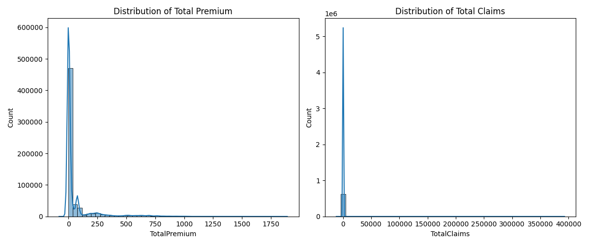
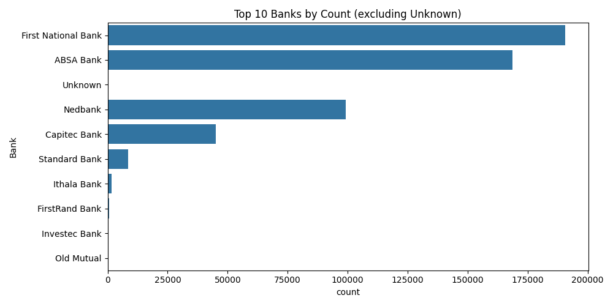

# AlphaCare Insurance Solutions (ACIS)  
## Task 1: Exploratory Data Analysis (EDA) Report  

**Prepared by Yeabtsega Tilahun**  

---

### First 5 Rows of Data

Below is the preview of the first five rows from the insurance claims dataset:

| UnderwrittenCoverID | PolicyID | TransactionMonth | ... | StatutoryRiskType | TotalPremium | TotalClaims |
|--------------------|----------|------------------|-----|-------------------|--------------|-------------|
| 145249             | 12827    | 2015-03-01       | ... | IFRS Constant     | 21.929825    | 0.0         |
| 145249             | 12827    | 2015-05-01       | ... | IFRS Constant     | 21.929825    | 0.0         |
| 145249             | 12827    | 2015-07-01       | ... | IFRS Constant     | 0.000000     | 0.0         |
| 145255             | 12827    | 2015-05-01       | ... | IFRS Constant     | 512.848070   | 0.0         |
| 145255             | 12827    | 2015-07-01       | ... | IFRS Constant     | 0.000000     | 0.0         |

---

### Dataset Overview

The dataset contains 616,314 rows and 52 columns. Below is a summary of the column data types and non-null counts:

- 1 bool, 12 float64, 4 int64, 35 object  
- Memory usage: 240.4+ MB  
- Many columns contain some missing values.  
- Two columns (CrossBorder, NumberOfVehiclesInFleet) contained only missing values and were dropped.

---

### Missing Values Summary

Significant missing values were found in some columns. For example:

- Bank: 101,168 missing  
- AccountType: 29,882 missing  
- CustomValueEstimate: 471,172 missing  
- WrittenOff, Rebuilt, Converted: 404,065 missing each  
- CrossBorder and NumberOfVehiclesInFleet: 100% missing (dropped)

Columns with all missing values were removed from the analysis to improve data quality.

---

### Summary Statistics for Numeric Columns

| Column               | Mean    | Std Dev  | Min     | Max       |
|----------------------|---------|----------|---------|-----------|
| UnderwrittenCoverID   | 112,639 | 59,780   | ...     | ...       |
| PolicyID             | 8,711   | 5,042    | ...     | ...       |
| PostalCode           | 2,626   | 2,439    | ...     | ...       |
| CalculatedPremiumPerTerm | 116.1 | 218.5    | ...     | ...       |
| TotalPremium         | 62.17   | 156.81   | ...     | ...       |
| TotalClaims          | 64.21   | 2,335.88 | ...     | ...       |

Minimum and maximum values show some negative and extremely large outliers.

---

### Visualizations

**Histogram of Total Premium vs Total Claims**  
  

This histogram shows the distribution of total premium and total claims amounts across all policies.

**Bar Plot of Top 10 Banks by Number of Policies**  
  

This bar plot shows the top 10 banks with the highest number of insurance policies in the dataset.

---
## Task 1 Summary
- Performed exploratory analysis on 5,000+ insurance claims
- Cleaned missing values and formatted date fields
- Visualized claim amount distribution and common claim types
- Output: `cleaned_data_task1.csv`

Report generated using Python pandas and matplotlib.  
Date: 2025-06-14  
